# Next.js Resume (with dark mode & flowchart)

This repository contains a small Next.js resume site with dark mode and a printable PDF option. It also includes a Mermaid flowchart describing "Hiring vs Googling" and an exported SVG of the flowchart.

Files added:
- components/Resume.tsx (main resume component)
- data/resume.ts (data for the resume)
- pages/index.tsx (home page that renders the resume)
- pages/flowchart.tsx (page that shows the exported SVG flowchart)
- pages/_app.tsx (global styles)
- styles/globals.css
- tailwind.config.js
- public/flowchart.svg (exported SVG of the Mermaid diagram)

Mermaid flowchart (original markup — you can paste this into any Mermaid renderer):

```mermaid
flowchart LR
    direction LR
    subgraph 1[" "]
        direction TB
        top1[Find Connor's Profile] --> bottom1[Hire Connor 🤝]
    end
    subgraph 2[" "]
        direction TB
        top2[Google Endlessly 🔎] --> bottom2[Waste Time ⌛]
    end

    %% Link to subgraph1
    3[Discover Problem 🐛] --> 1

    %% Link within subgraph2
    3[Discover Problem 🐛] --> 2

    1 --> outside1["Profit" 📈]
    2 --> outside2["Cry" 😢]

    click top1 "https://www.linkedin.com/in/connor-kaiser-6a335a316/" "LinkedIn"

    style 1 stroke:#072ff7,stroke-width:5px
    style 2 stroke:#f70707,stroke-width:5px
```

